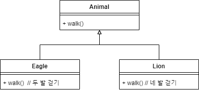
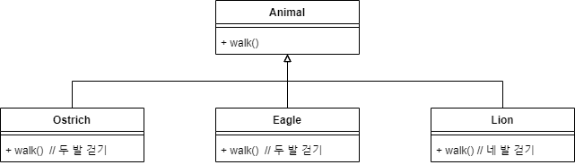
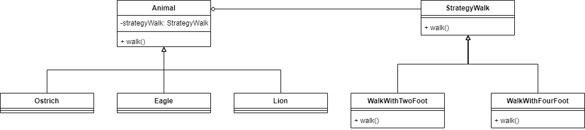
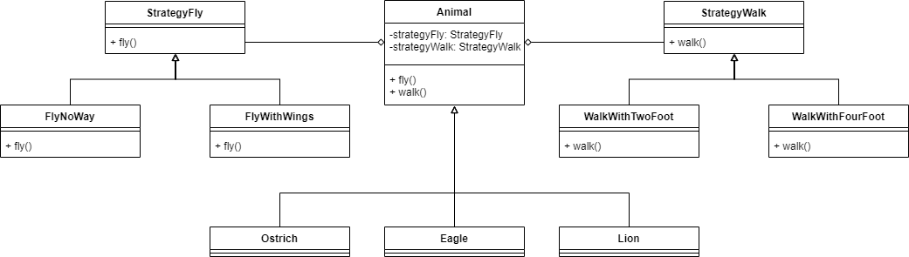

# Design pattern - Strategy pattern


## 강의 개요

이번 강의에서는 State 패턴이 무엇이고 언제 사용하는 지에 대해서 알아봅니다.

우선 위키백과의 정의를 살펴보면 다음과 같습니다.

::: tip 전략 패턴(strategy pattern)
전략 패턴(strategy pattern) 또는 정책 패턴(policy pattern)은 실행 중에 알고리즘을 선택할 수 있게 하는 행위 소프트웨어 디자인 패턴이다. 전략 패턴은

* 특정한 계열의 알고리즘들을 정의하고
* 각 알고리즘을 캡슐화하며
* 이 알고리즘들을 해당 계열 안에서 상호 교체가 가능하게 만든다.

전략은 알고리즘을 사용하는 클라이언트와는 독립적으로 다양하게 만든다.
* 위키백과
:::

간략하게 설명하자면 객체 타입에 따라서 특정 메소드(알고리즘)의 행동이 달라질 경우 사용하는 패턴입니다.


예를 들면 턴테이블의 기능은 언제나 동일하지만,
어떤 레코드 판을 올려 놓느냐에 따라 다른 음악이 재생되는 것과 같습니다.

이렇게 동작 방식의 형태(인터페이스)만 약속 해두고
구체적은 동작은 모듈을 장착하듯이 변경할 수 있어야 하는 상황에서 전략 패턴을 활용할 수 있습니다.


### 다형성을 통해서 해결하기

위의 설명대로라면 다형성을 사용하면 되지 않을까요?
마치 아래와 같이 독수리와 사자가 walk()라는 인터페이스를 공유하지만,
각자 다른 방식으로 걷는 것을 구현하는 것처럼요.




###  타조 클래스가 추가되자 중복 코드 발생

그런데 여기서 타조 클래스가 추가된다면 어떻게 될까요?



타조와 독수리의 걷기 메소드가 중복으로 구현되는 문제가 생겼습니다.


### 전략 패턴으로 해결하기



전략패턴을 사용하면 걷는 방식을 구현한 외부의 코드를 선택해서
원하는 동작을 장착하듯이 사용할 수 있습니다.
코드의 중복 문제를 피해갈 수 있는 것이죠.


## 동물의 걷기 전략의 예제

### 기본 코드 살펴보기

``` java
import java.util.Scanner;

interface StrategyWalk {
    public void walk();
}

class Animal {
    Animal(StrategyWalk strategyWalk) {
        this.strategyWalk = strategyWalk;
    }

    public void walk() {
        strategyWalk.walk();
    }

    private StrategyWalk strategyWalk;
}

public class Main {
    public static void main(String[] args) {
        // Ostrich ostrich = new Ostrich();
        // Eagle eagle = new Eagle();
        // Lion lion = new Lion();
        Scanner in = new Scanner(System.in);
        while (true) {
            String line = in.nextLine();
            switch (line) {
                // case "w1": ostrich.walk(); break;
                // case "w2": eagle.walk(); break;
                // case "w3": lion.walk(); break;
                case "q": return;
            }
        }
    }
}
```

### 타조, 독수리 그리고 사자 클래스 구현

``` java
...

class Ostrich extends Animal {
    Ostrich() {
        // super(new WalkWithTwoFoot());
    }
}

class Eagle extends Animal {
    Eagle() {
        // super(new WalkWithTwoFoot());
    }
}

class Lion extends Animal {
    Lion() {
        // super(new WalkWithFourFoot());
    }
}

public class Main {
    public static void main(String[] args) {
        Ostrich ostrich = new Ostrich();
        Eagle eagle = new Eagle();
        Lion lion = new Lion();
        Scanner in = new Scanner(System.in);
        while (true) {
            String line = in.nextLine();
            switch (line) {
                case "w1": ostrich.walk(); break;
                case "w2": eagle.walk(); break;
                case "w3": lion.walk(); break;
                case "q": return;
            }
        }
    }
}
```

### 두 개의 전략 클래스 구현

``` java
...

class WalkWithTwoFoot implements StrategyWalk {
    public void walk() {
        System.out.println("Walking with two foot...");
    }
}

class WalkWithFourFoot implements StrategyWalk {
    public void walk() {
        System.out.println("Walking with four foot...");
    }
}

class Ostrich extends Animal {
    Ostrich() {
        super(new WalkWithTwoFoot());
    }
}

class Eagle extends Animal {
    Eagle() {
        super(new WalkWithTwoFoot());
    }
}

class Lion extends Animal {
    Lion() {
        super(new WalkWithFourFoot());
    }
}

...
```


### 완성된 코드

``` java
import java.util.Scanner;

interface StrategyWalk {
    public void walk();
}

class Animal {
    Animal(StrategyWalk strategyWalk) {
        this.strategyWalk = strategyWalk;
    }

    public void walk() {
        strategyWalk.walk();
    }

    private StrategyWalk strategyWalk;
}

class WalkWithTwoFoot implements StrategyWalk {
    public void walk() {
        System.out.println("Walking with two foot...");
    }
}

class WalkWithFourFoot implements StrategyWalk {
    public void walk() {
        System.out.println("Walking with four foot...");
    }
}

class Ostrich extends Animal {
    Ostrich() {
        super(new WalkWithTwoFoot());
    }
}

class Eagle extends Animal {
    Eagle() {
        super(new WalkWithTwoFoot());
    }
}

class Lion extends Animal {
    Lion() {
        super(new WalkWithFourFoot());
    }
}

public class Main {
    public static void main(String[] args) {
        Ostrich ostrich = new Ostrich();
        Eagle eagle = new Eagle();
        Lion lion = new Lion();
        Scanner in = new Scanner(System.in);
        while (true) {
            String line = in.nextLine();
            switch (line) {
                case "w1": ostrich.walk(); break;
                case "w2": eagle.walk(); break;
                case "w3": lion.walk(); break;
                case "q": return;
            }
        }
    }
}
```


## 날기 전략을 추가한 예제




### 기본 코드 살펴보기

``` java
import java.util.Scanner;

interface StrategyFly {
    public void fly();
}

interface StrategyWalk {
    public void walk();
}

class Animal {
    Animal(StrategyFly strategyFly, StrategyWalk strategyWalk) {
        this.strategyFly = strategyFly;
        this.strategyWalk = strategyWalk;
    }

    public void fly() {
        strategyFly.fly();
    }

    public void walk() {
        strategyWalk.walk();
    }

    private StrategyFly strategyFly;
    private StrategyWalk strategyWalk;
}

public class Main {
    public static void main(String[] args) {
        // Ostrich ostrich = new Ostrich();
        // Eagle eagle = new Eagle();
        // Lion lion = new Lion();
        Scanner in = new Scanner(System.in);
        while (true) {
            String line = in.nextLine();
            switch (line) {
                // case "f1": ostrich.fly(); break;
                // case "w1": ostrich.walk(); break;
                // case "f2": eagle.fly(); break;
                // case "w2": eagle.walk(); break;
                // case "f3": lion.fly(); break;
                // case "w3": lion.walk(); break;
                case "q": return;
            }
        }
    }
}
```


### 완성된 코드

``` java
import java.util.Scanner;

interface StrategyFly {
    public void fly();
}

interface StrategyWalk {
    public void walk();
}

class Animal {
    Animal(StrategyFly strategyFly, StrategyWalk strategyWalk) {
        this.strategyFly = strategyFly;
        this.strategyWalk = strategyWalk;
    }

    public void fly() {
        strategyFly.fly();
    }

    public void walk() {
        strategyWalk.walk();
    }

    private StrategyFly strategyFly;
    private StrategyWalk strategyWalk;
}

class FlyNoWay implements StrategyFly {
    public void fly() {
        System.out.println("No Way! I can't fly.");
    }
}

class FlyWithWings implements StrategyFly {
    public void fly() {
        System.out.println("Yes! I can fly.");
    }
}

class WalkWithTwoFoot implements StrategyWalk {
    public void walk() {
        System.out.println("Walking with two foot...");
    }
}

class WalkWithFourFoot implements StrategyWalk {
    public void walk() {
        System.out.println("Walking with four foot...");
    }
}

class Ostrich extends Animal {
    Ostrich() {
        super(new FlyNoWay(), new WalkWithTwoFoot());
    }
}

class Eagle extends Animal {
    Eagle() {
        super(new FlyWithWings(), new WalkWithTwoFoot());
    }
}

class Lion extends Animal {
    Lion() {
        super(new FlyNoWay(), new WalkWithFourFoot());
    }
}

public class Main {
    public static void main(String[] args) {
        Ostrich ostrich = new Ostrich();
        Eagle eagle = new Eagle();
        Lion lion = new Lion();

        Scanner in = new Scanner(System.in);
        while (true) {
            String line = in.nextLine();
            switch (line) {
                case "f1": ostrich.fly(); break;
                case "w1": ostrich.walk(); break;
                case "f2": eagle.fly(); break;
                case "w2": eagle.walk(); break;
                case "f3": lion.fly(); break;
                case "w3": lion.walk(); break;
                case "q": return;
            }
        }
    }
}
```


## 마무리

* 전략 객체 주입을 생성 시에만 해야 할까?
* 전략 클래스가 하나의 메소드만 가져야 할까?