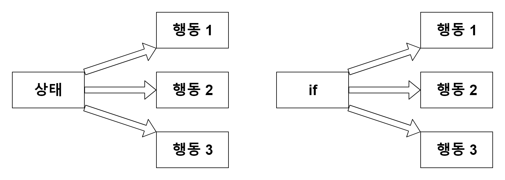
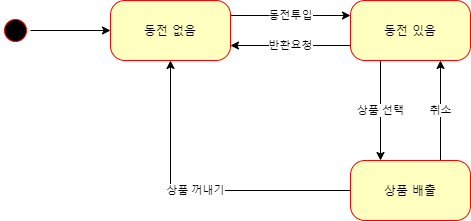
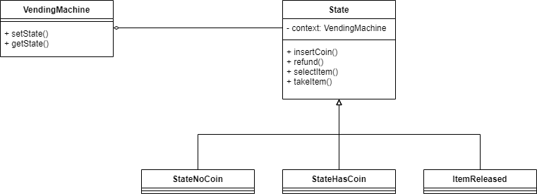
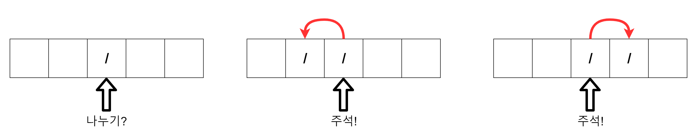
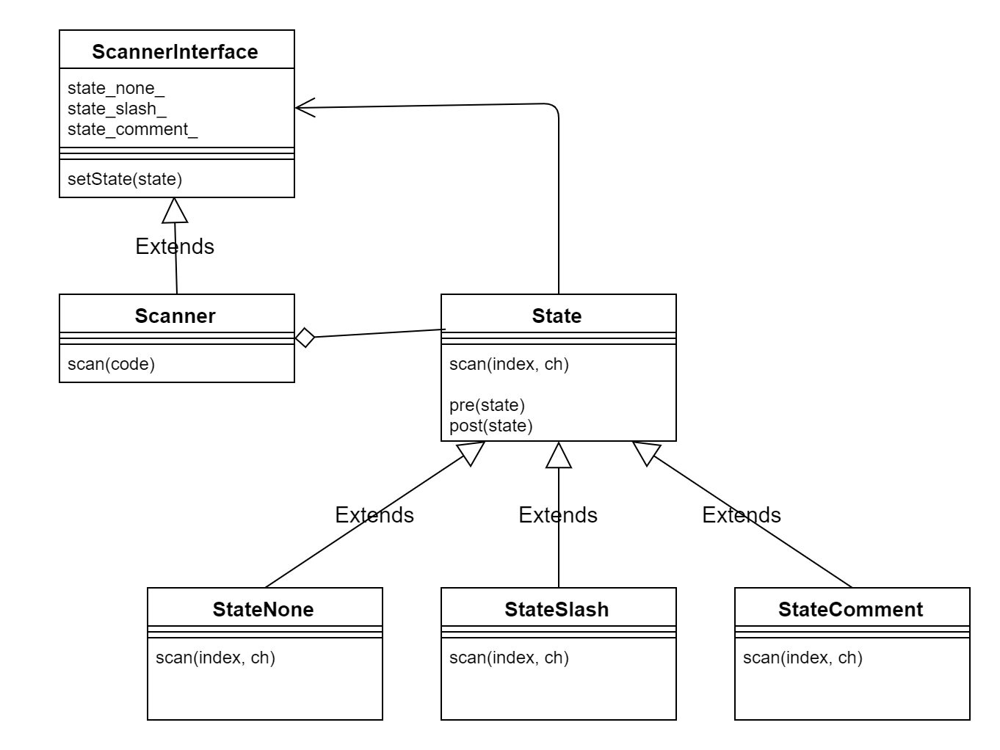
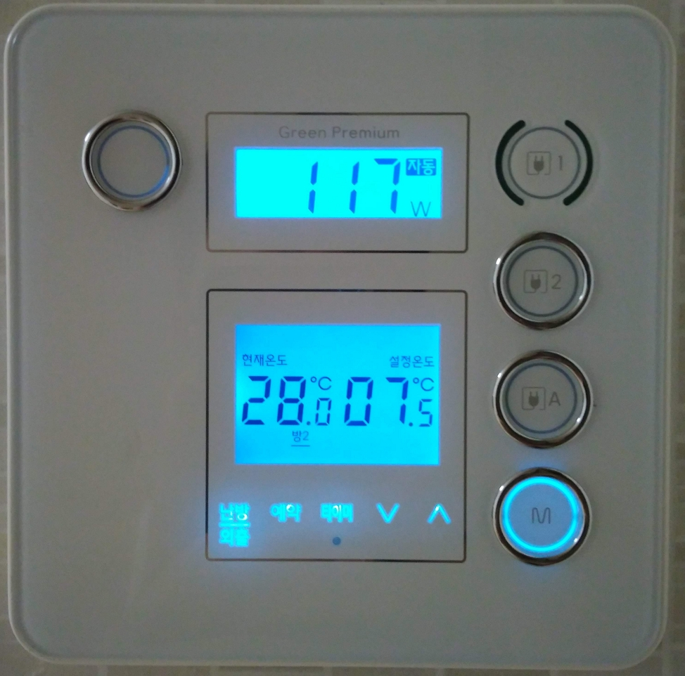
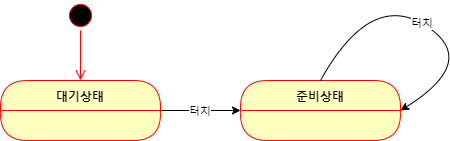
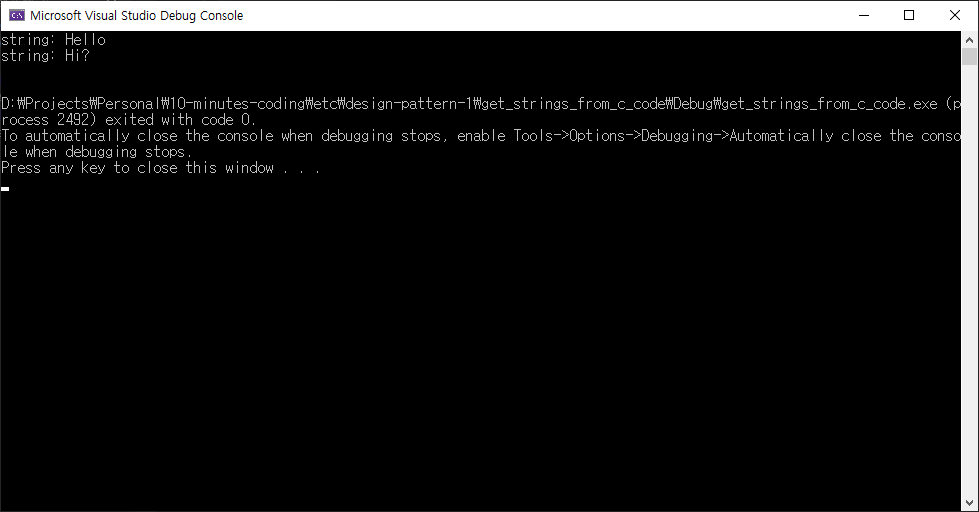
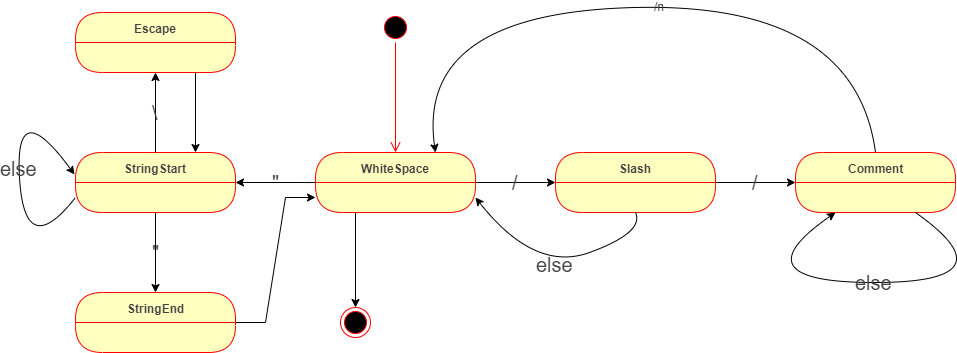

# Design pattern - State pattern

::: tip 예제 코드
[https://github.com/ryujt/design_pattern](https://github.com/ryujt/design_pattern)
:::


## 강의 개요

이번 강의에서는 State 패턴이 무엇이고 언제 사용하는 지에 대해서 알아봅니다.

우선 위키백과의 정의를 살펴보면 다음과 같습니다.

::: tip 상태 패턴(state pattern)
상태 패턴(state pattern)은 객체 지향 방식으로 상태 기계를 구현하는 행위 소프트웨어 디자인 패턴이다. 상태 패턴을 이용하면 상태 패턴 인터페이스의 파생 클래스로서 각각의 상태를 구현함으로써, 또 패턴의 슈퍼클래스에 의해 정의되는 메소드를 호출하여 상태 변화를 구현함으로써 상태 기계를 구현한다.

* 위키백과
:::

조금 단순하게 설명해보겠습니다. State 패턴은 상태 또는 조건에 따라 각기 다른 일을 처리하고 싶을 때 활용할 수 있는 패턴입니다. 가만히 들어보면 조건문만으로도 충분한 것 같습니다.



조건문대신 State 패턴이 유리한 경우는 아래와 같이 두 가지의 경우를 생각할 수 있습니다.

::: tip State 패턴 적용이 더 유리한 경우
* 상태에 영향을 받는 메소드가 여럿인 경우
* 과거의 상태가 현재에게 영향을 주거나 현재의 상태가 미래에서 결정이 나는 경우
:::

상태가 이전 상태에게 영향을 받고 이후 상태에게 영향을 줄 수 있다면, 서로의 연관 관계가 복잡해질 가능성이 있습니다. 단지 현재의 상태나 조건만으로 결정을 지을 수 없기 때문에 이전의 상태의 변화 내용을 참조해야합니다. 이런 경우라면 State 패턴을 적용할 것을 고려해 볼 필요가 있습니다.

아래는 상태도라고 부르며, 상태들의 관계를 다이어그램으로 나타낸 것입니다. 어떤 조건에서 상태가 다른 상태로 전이되어야 하는 지에 대한 정보를 제공합니다.


## 상태에 영향을 받는 메소드가 여럿인 경우




### 상태 인터페이스

``` java
interface State {
    void insertCoin(); // 동전 투입
    void refund(); //  환불 요청
    void selectItem(); //  상품 선택
    void takeItem(); //  상품  꺼내기
}
```

### 동전 없음 클래스의 예

``` java
class StateNoCoin implements State {
    void insertCoin() {
        context.setState(new StateHasCoin());
    }

    public void refund() {
        System.out.println("반환 할 동전이 없습니다.");
    }

    public void selectItem() {
        System.out.println("동전을 먼저 넣어 주세요.");
    }

    public void takeItem() {
        System.out.println("꺼낼 상품이 없습니다.");
    }
}
```

### 동전 있음 클래스의 예

``` java
class StateHasCoin implements State {
    void insertCoin() {
        System.out.println("이미 동전을 투입하셨습니다.");
    }

    public void refund() {
        context.setState(new StateNoCoin());
    }

    public void selectItem() {
        context.setState(new ItemReleased());
    }

    public void takeItem() {
        System.out.println("꺼낼 상품이 없습니다.");
    }
}
```

### if 문을 사용했을 때와 비교

``` java
class Context {
    void insertCoin() {
        switch (state) {
            case noCoin:
                state = hasCoin;
                break;
            case hasCoint:
                System.out.println("이미 동전을 투입하셨습니다.");
                break;
            case itemReleasing:
                System.out.println("상품 배출 중입니다.");
                break;
            case itemReleased:
                System.out.println("상품 배출 완료, 잠시만 기다려주세요.");
                break;
        }
    }

    void refund() {
        switch (state) {
            case noCoin:
                System.out.println("반환 할 동전이 없습니다.");
                break;
            case hasCoint:
                state = noCoin;
                break;
            case itemReleasing:
                System.out.println("상품 배출 중입니다.");
                break;
            case itemReleased:
                System.out.println("상품 배출 완료, 잠시만 기다려주세요.");
                break;
        }
    }

    void selectItem() {
        ...
    }

    void takeItem() {
        ...
    }
}
```

### 실제 구현 코드




#### 기본 코드 살펴보기

``` java
import java.util.Scanner;

class VendingMachine {
    public void setState(State state) {
        this.state = state;
        state.context = this;
        System.out.println("상태변경: " + state.toString());
    }

    public State getState() {
        return state;
    }

    private State state;
}

class State {
    VendingMachine context = null;
    public void insertCoin() {}
    public void refund() {}
    public void selectItem() {}
    public void takeItem() {}
}

class Main {
    public static void main(String[] args) {
        VendingMachine machine = new VendingMachine();

        Scanner in = new Scanner(System.in);
        while (true) {
            String line = in.nextLine();
            switch (line) {
                case "i": machine.getState().insertCoin(); break;
                case "r": machine.getState().refund(); break;
                case "s": machine.getState().selectItem(); break;
                case "t": machine.getState().takeItem(); break;
                case "q": return;
            }
        }
    }
}
```


#### 완성된 코드

``` java
import java.util.Scanner;

class VendingMachine {
    public void setState(State state) {
        this.state = state;
        state.context = this;
        System.out.println("상태변경: " + state.toString());
    }

    public State getState() {
        return state;
    }

    private State state;
}

class State {
    VendingMachine context = null;
    public void insertCoin() {}
    public void refund() {}
    public void selectItem() {}
    public void takeItem() {}
}

class StateNoCoin extends State {
    public void insertCoin() {
        context.setState(new StateHasCoin());
    }

    public void refund() {
        System.out.println("반환 할 동전이 없습니다.");
    }

    public void selectItem() {
        System.out.println("동전을 먼저 넣어 주세요.");
    }

    public void takeItem() {
        System.out.println("꺼낼 상품이 없습니다.");
    }
}

class StateHasCoin extends State {
    public void insertCoin() {
        System.out.println("이미 동전을 투입하셨습니다.");
    }

    public void refund() {
        System.out.println("동전을 반환합니다.");
        context.setState(new StateNoCoin());
    }

    public void selectItem() {
        context.setState(new ItemReleased());
    }

    public void takeItem() {
        System.out.println("꺼낼 상품이 없습니다.");
    }
}

class ItemReleased extends State {
    public void insertCoin() {
        System.out.println("상품을 먼저 꺼내주세요.");
    }

    public void refund() {
        System.out.println("반환 할 동전이 없습니다.");
    }

    public void selectItem() {
        System.out.println("상품을 먼저 꺼내주세요.");
    }

    public void takeItem() {
        context.setState(new StateNoCoin());
    }
}

class Main {
    public static void main(String[] args) {
        VendingMachine machine = new VendingMachine();
        machine.setState(new StateNoCoin());

        Scanner in = new Scanner(System.in);
        while (true) {
            String line = in.nextLine();
            switch (line) {
                case "i": machine.getState().insertCoin(); break;
                case "r": machine.getState().refund(); break;
                case "s": machine.getState().selectItem(); break;
                case "t": machine.getState().takeItem(); break;
                case "q": return;
            }
        }
    }
}
```


## 과거 또는 미래의 상태가 현재에 영향을 주는 경우

State 패턴을 사용한 경우와 그렇지 않은 경우를 비교하기 위해서 비교적 단순한 예제를 통해서 설명해보도록 하겠습니다. 주어진 C 코드 문자열 속에서 나누기 기호를 찾는 것이 주어진 문제입니다.

문자열의 문자들을 하나씩 일어나가다가 현재의 문자가 슬러시(/)였다면 바로 나누기라고 판단할 수가 없다는 것에 유의해야 합니다. 이전 문자 또는 다음 문자가 슬러시라면 나누기 기호가 아니고 주석의 일부라고 판단해야 하기 때문입니다.



::: tip
문제를 단순하게 하기 위해서 /* */ 형태의 주석은 무시합니다.
:::


### 조건문과 플래그를 사용하는 방법

가장 단순하게 접근할 수 있는 조건문을 사용하는 예제입니다. 이전과 이후 상태를 함께 판단해야 하기 때문에 flag 변수를 만들어서 이전 정보를 기억했다가 사용하는 방식을 사용하고 있습니다.

``` cpp
#include <stdio.h>
#include <string>

using namespace std;

int main()
{
	string code = "printf(..., 2 / 4); // 나누기 결과 출력";
	char ch_prev = 0;

	for (int i=0; i<code.size(); i++) {
		char ch = code.at(i);

		char ch_next = 0;
		if (i < (code.size() -1)) ch_next = code.at(i + 1);

		if ((ch == '/') && (ch_prev != '/') && (ch_next != '/')) {
			printf("%d: 나누기를 찾았습니다. \n", i);
		}

		ch_prev = ch;
	}
}
```
* 11-22: 문자열의 크기만큼 반복하면서 한 문자씩 검사합니다.
* 14-15: 다음 문자를 가져옵니다. 현재 문자가 문자열의 마지막이 아닌 경우에만 가져옵니다.
* 17-19: 현재 문자가 슬러시인데, 이전과 이후 문자가 슬러시가 아니라면 현재 문자는 나누기 기호라고 판단합니다.
* 21: 다음 반복에서 사용하기 위해서 현재의 문자를 이전 문자를 담는 변수에 저장합니다.


### 클래스 없이 구현한 State 패턴

이번에는 상태도를 이용해서 같은 문제를 표현해보겠습니다.


* None
  * 초기 상태입니다.
  * 초기 상태에서 문자를 계속 입력받는 이벤트가 발생한다고 가정합니다.
  * 초기 상태에서 탈출할 수 있는 조건은 슬러시(/)가 발견되는 화살표 하나입니다. 즉 슬러시가 발견되면 Slash 상태가 됩니다.
* Slash
  * Slash 상태에서는 두 가지 탈출 조건이 가능합니다.
    * 슬러시가 발견되었을 경우 → 상태를 Comment로 변경합니다.
    * 슬러시 이외의 문자가 발견되었을 경우 → 자신은 나누기 기호라고 판단할 수 있고, 초기 상태로 돌아가서 처음부터 다시 시작합니다.
* Comment
  * 화살표가 하나이면 조건이 없습니다. 무조건 상태가 초기 상태로 변경됩니다.

아래 상태도를 그대로 코드로 표현한 것입니다. 클래스를 사용하지 않고 분기문만으로 상태를 표현한 예제입니다.

``` cpp
#include <stdio.h>
#include <string>

using namespace std;

enum State {stNone, stSlash, stComment};
State state;

void do_none(int i, char ch)
{
	if (ch == '/') state = stSlash;
}

void do_slash(int i, char ch)
{
	if (ch == '/') state = stComment;
	else {
		printf("%d: 나누기를 찾았습니다. \n", i-1);
		state = stNone;
	}
}

void do_comment(int i, char ch)
{
	state = stNone;
}

int main()
{
	string code = "printf(..., 2 / 4); // 나누기 결과 출력";

	state = stNone;
	for (int i=0; i<code.size(); i++) {
		switch (state) {
			case stNone: do_none(i, code.at(i)); break;
			case stSlash: do_slash(i, code.at(i)); break;
			case stComment: do_comment(i, code.at(i)); break;
		}
	}
}
```
* 33-39: 문자열의 크기만큼 반복하면서 한 문자씩 검사합니다.
* 34-38: 현재 상태에 따라 일대 일로 지정된 함수를 실행합니다. 현재 위치와 문자를 파라메터로 전달합니다.
* 9-12: None(초기) 상태의 경우만 고려해서 처리하는 함수입니다.
  * 슬러시가 발견되면 상태를 stSlash로 변경합니다. 상태도와 비교해보세요.
* 14-21: Slash 상태의 경우만 고려해서 처리하는 함수입니다.
  * 슬러시가 발견되면 상태를 stComment로 변경합니다. 상태도와 비교해보세요.
  * 그 이외의 문자가 발견되면 초기 상태로 변경합니다.
* 23-26: Comment 상태의 경우만 고려해서 처리하는 함수입니다.
  * 무조건 상태를 초기 상태로 변경합니다.

::: tip 이번 예제의 장점
* 각 상태가 독립적으로 구별되어서 문제를 보다 단순한 작은 문제로 나눠서 처리할 수 있다.
* 상태도를 통해서 복잡한 인과 관계를 보다 명확하게 설계 할 수 있다.
:::


### 클래스를 이용한 State 패턴

이번에는 클래스를 이용하여 State 패턴을 구현해보겠습니다. 아래 클래스 다이어그램은 이전에 풀었던 문제를 해결하기 위해서 설계된 내용을 설명하고 있습니다.

::: tip
아래 클래스 다이어그램은 일반적으로 볼 수 있는 State 패턴의 다이어그램과 다른 부분이 있습니다. ScannerInterface 부분인데요. Scanner는 State를 참조하게 되어 있습니다. 그런데 State도 Scanner의 상태를 변경하기 위해서 setState() 메소드를 참조해야합니다. 이때 순환 참조가 문제가 발생합니다.

C/C++ 언어에서는 순환 참조를 하기위해서 헤더 파일을 사용해야 하는데요, 코드를 분리하지 않고 하나로 통일하기 위해서 인테페이스 부분만 참조하도록 하고, Scanner가 이를 상속받는 구조를 만들었습니다. 덤으로 State 객체들이 Scanner에서 필요하지 않은 부분들은 감출 수 있다는 장점도 있습니다.
:::



코드가 길어서 부분적으로 나눠서 설명하도록 하겠습니다. 코드의 양이 늘었지만, 이전의 방법보다 클래스를 사용하는 방법이 효과적인 경우가 있습니다. 해법은 언제나 다양하고 상황에 맞춰서 최선을 선택하는 것이 중요합니다. 어느 해법이 언제나 우월한 경우는 없습니다.


#### 전반적인 소스 구조

``` cpp
class State;

class ScannerInterface {
public:
	virtual void setState(State* state) {}
	State* state_none_;
	State* state_slash_;
	State* state_comment_;
};

class State {
public:
	virtual void scan(int index, char ch) = 0;
	virtual void pre(State* prior) {}
	virtual void post(State* next) {}
	ScannerInterface* scanner_;
};

class StateNone : State {
};

class StateSlash : State {
};

class StateComment : State {
};

class Scanner : ScannerInterface {
public:
	void scan(string code) {}
private:
	State* current_state_;
};

int main()
{
	Scanner scanner;
	scanner.scan("printf(..., 2 / 4); // 나누기 결과 출력");
}
```
* 우선 클래스 다이어그램의 중요 인터페이스 부분들을 위주로 전반적인 형태만 구현한 상태입니다.


#### StateNone 클래스 구현

``` cpp
class StateNone : State {
public:
	StateNone(ScannerInterface* scanner)
	{
		scanner_ = scanner;
	}

	virtual void scan(int index, char ch)
	{
		if (ch == '/') scanner_->setState(scanner_->state_slash_);
	}
};
```
* 3-5: 스캐너 객체의 레퍼런스를 저장합니다. 상태 변경을 요청 할 때 사용합니다.
* 10: 앞서 설명한 상태도대로 슬러시가 발견되면 Slash 상태로 변경합니다.


#### StateSlash 클래스 구현

``` cpp
class StateSlash : State {
public:
	StateSlash(ScannerInterface* scanner)
	{
		scanner_ = scanner;
	}

	virtual void scan(int index, char ch)
	{
		if (ch == '/') scanner_->setState(scanner_->state_comment_);
		else {
			printf("%d: 나누기를 찾았습니다. \n", index-1);
			scanner_->setState(scanner_->state_none_);
		}
	}
};
```
* 10: 슬러시가 발견되면 Comment 상태로 변경합니다.
* 11-14: 그 이외의 문자라면 나누기 기호라고 판단하고 콘솔에 표시합니다. 이어서 None(초기) 상태로 변경합니다.


#### StateComment 클래스 구현

``` cpp
class StateComment : State {
public:
	StateComment(ScannerInterface* scanner)
	{
		scanner_ = scanner;
	}

	virtual void scan(int index, char ch)
	{
		scanner_->setState(scanner_->state_none_);
	}
};
```
* 10: 무조건 None(초기) 상태로 변경합니다.


#### Scanner 클래스 구현

``` cpp
class Scanner : ScannerInterface {
public:
	Scanner()
	{
		state_none_ = (State*) new StateNone(this);
		state_slash_ = (State*) new StateSlash(this);
		state_comment_ = (State*) new StateComment(this);
	}

	void scan(string code)
	{
		current_state_ = state_none_;
		for (int i=0; i<code.size(); i++) {
			current_state_->scan(i, code.at(i));
		}
	}

	virtual void setState(State* state)
	{
		current_state_->post(state);
		state->pre(current_state_);
		current_state_ = state;
	}

private:
	State* current_state_;
};
```
* 10-16: 문자열의 크기만큼 반복하면서 한 문자씩 검사합니다. 현재 상태에 scan() 메소드를 호출하여 문자 입력 이벤트를 처리합니다. Scanner는 조건이나 상태 변경 등의 구체적인 내용은 신경쓰지 않습니다. 모든 것이 상태 객체 안에 캡슐화되어 처리 됩니다.
* 18-23: 이번 예제에서는 활용하고 있지 않지만, 상태가 변경되기 전에 이전 선행처리나 후행처리가 필요한 경우, pre(), post() 메소드를 이용합니다. 선행처리와 후행처리가 필요한 객체들은 pre(), post() 메소드를 재정의하기만 하면 원하는 처리가 가능해집니다.

[전체 코드 참조](https://github.com/ryujt/design_pattern/blob/master/c%2B%2B/state_pattern/find_slash_3/find_slash_3/find_slash_3.cpp)

::: tip 클래스를 활용했을 때 장점
* 각 상태를 다루는 코드의 독립성이 가장 높다. 모든 상태 코드가 서로 클래스 단위로 격리되기 때문이다.
  * 특히 상태 처리에 필요한 독립적인 정보를 관리하는데 유리하다.
* 객체마다 독립적인 선행,후행 처리가 자연스럽다.
* 한 상태에서 처리되는 이벤트가 다양한 경우 효율적이다. (현재의 예제에서는 scan() 한 가지만 처리되고 있습니다)
:::


## 전등 스위치의 예

::: warning
시간이 지나면 발생하는 timer() 이벤트를 추가해서 새로 작성할 예정입니다.
:::

### 문제에 대한 분석

아래의 스위치에 대한 코드를 살펴보도록 하겠습니다. 이 스위치는 한 번 터치하면 불이 들어오면서 준비 상태가 됩니다. 준비 상태가 된 이후에는 모든 스위치가 터치될 때마다 작동합니다. 그리고 한 참 동안 사용하지 않으면 불이 꺼지면서 대기 상태가 됩니다.



아래 코드는 이해를 위해 간략하게 만들어진 예제입니다. 버튼이 터치되었을 때 준비상태가 아니면 준비상태로 변경하고 터치는 무시됩니다. 다시 터치하면 램프가 켜져있을 때에는 끄고, 꺼져있을 때는 켜도록 합니다. 아직 시간이 지나면 대기 상태가 되도록 하는 코드는 표현되지 않은 상태입니다.
``` java
터치이벤트_핸들러()
{
    if (팬널.준비상태 == false) {
        팬널.준비상태 = true;
        return;
    }

    if (램프 == on) 램프.off();
    else 램프.on();
}
```

이러한 코드는 요구사항의 변화가 발생하면 걷잡을 수 없이 복잡해질 가능성이 있습니다. <b>현재의 상태가 이전에 발생한 사건에 의해서 영향을 받기 때문</b>입니다.


### State 패턴의 적용

전등 스위치 코드를 상태도로 표현해보면 아래와 같습니다. 쉬운 설명을 위해서 준비상태에서 시간이 흐르면 대기상태가 되는 조건은 생략되어 있습니다.


* 처음에는 대기상태가 됩니다.
* 대기상태에서 터치가 발생하면 준비상태가 됩니다.
* 준비상태에서 터치가 발생하면 계속 준비상태를 유지합니다.

상태도를 코드로 표현하면 아래와 같습니다. 코드를 간결하게 하여 쉽게 이해가 되도록 클래스를 사용하지 않고 열겨형과 switch문을 사용하여 표현하였습니다.

``` java
enum State {stNotReady, stReady}

State state = stNotReady;

터치이벤트_핸들러()
{
    switch(state) {
        case stNotReady: do_NotReady(); break;
        case stReady: do_Ready(); break;
    }
}

void do_NotReady()
{
    state = stNotReady;
}

void do_Ready()
{
    if (램프 == on) 램프.off();
    else 램프.on();
}
```
이 코드의 장점은 각 상태를 처리하는 코드가 함수별로 분리되어 모듈처럼 추가 장착이나 변경 또는 삭제가 용이해졌다는 것 입니다. 또한, 코드가 상태별로 격리되어서 처리되기 때문에 특정 상태의 처리에 대한 요구사항 변화가 다른 상태에 영향을 주는 것을 최소화 할 수 있는 가능성이 생겼습니다.

하지만 여전히 "처음에 제시한 코드가 그렇게 문제가 있나?"라고 묻는다면 확실하게 답변하기가 어렵습니다. 규모가 작거나 쉬운 문제를 해결하는 데에는 단순한 해법이 더 좋을 수 있습니다.

### 상속(클래스)을 이용하여 State 패턴을 적용한 코드

``` java
State state_not_ready = new StateNotReady();
State state_ready = new StateReady();

class State {
    void touch() {}
}

class StateNotReady extends State {
    void touch()
    {
        state = state_ready;
    }
}

class StateReady extends State {
    void touch()
    {
        if (램프 == on) 램프.off();
        else 램프.on();
    }
}

State state = state_not_ready;

터치이벤트_핸들러()
{
    state.touch();
}
```


## 코드에서 문자열만 골라내기

위에서 다룬 예제의 경우에는 문제 자체가 간단하기 때문에 State 패턴을 적용한 코드가 더 좋다라고 확실히 말하기가 어렸습니다. 이번에는 조금만 더 난이도를 높여서 프로그래밍 코드에서 문자열만 골라내는 예제를 만들어 보겠습니다.

::: tip
계속해서 읽기 전에 한 번 직접 해결방법을 고민해보시기 바랍니다.
:::

### Step 1 - 아주 단순한 경우에만 동작하는 코드

문제를 조금 더 단순하게 보이도록 문자열 표현을 큰 따옴표(") 대신 작은 따옴표(')를 이용하는 프로그래밍 코드라고 가정하겠습니다.

``` cpp
#include <iostream>

int main()
{
    // 현재 문자열 안에 있는 지 알려준다.
	bool in_string = false;

	std::string code = "if (text == 'Hello') printf('Hi? \n'); .... ";
	std::string buffer = "";

    char* current = (char*) code.c_str();
	while (*current != 0x00) {
        // 따옴표를 발견하면
		if (*current == '\'') {
            // 문자열 안에 있었다면 문자열이 끝났음을 in_string 변수에 저장하고
            // 현재까지 모은 문자열을 화면에 표시한다.
			if (in_string) {
				in_string = false;
				printf("string: %s \n", buffer.c_str());

            // 문자열 밖이었다면 문자열 안에 들어갔음을 in_string 변수에 저장하고
            // buffer를 초기화하여 문자열을 모을 준비를 한다.
			} else {
				in_string = true;
				buffer = "";
			}
		} else {
            // 문자열 안에 있을 때에만 buffer에 문자열 내용을 하나씩 저장한다.
			if (in_string) buffer = buffer + *current;
		}

		current++;
	}
}
```
위의 코드를 실행하면 code 변수 안에 있는 문자열 중에 작은 따옴표 안에 있는 문자열을 찾아서 표시해줍니다. 결과는 아래 이미지와 같습니다.



::: tip
위의 코드를 State 패턴을 적용해서 다시 만들어보세요.
:::


### Step 2 - 주석과 문자열 안에 따옴표 처리하기

만약 코드 내용이 아래와 같다면 어떻게 문자열을 찾아야 할까요? 이번에는 C 언어와 동일하게 큰 따옴표로 문자열을 표현하겠습니다.

주석은 "//"만 처리하겠습니다.

::: tip
/* */ 등을 처리하는 것도 고민해보세요.
:::

``` cpp
// 주석 "주석 안에 따옴표"
char text[1024] = "문자열...\" <-- 문자열 안의 따옴표"; ...
```

이 상황은 State 패턴을 사용하지 않고 풀어가는 것이 꽤나 어렵기 때문에 바로 State 패턴으로 풀어보겠습니다. 우선 상태도를 통해서 해법을 살펴보도록 하겠습니다.



따옴표와 문자열을 제외한 나머지 문자들은 의미 없는 화이트 스페이스로 처리합니다.
* 시작하자마자 WhiteSpace 상태로 시작합니다.
* WhiteSpace 상태에서 문자열을 한 글자씩 읽어 가면서 슬러시(/)를 발견하면 Splash 상태로 전이합니다.
* Splash 상태에서 다음 문자가 또 다시 슬러시이면 Comment 상태가 됩니다. 주석이 시작된 것입니다.
* Splash 상태에서 다음 문자가 슬러시 이외의 문자라면 WhiteSpace 상태로 전이합니다.
* Comment 상태에서는 \n 문자로 새 줄이 시작하기 전까지는 주석 상태가 유지됩니다. 다음 문자가 \n 문자라면 주석이 끝나고 WhiteSpace 상태로 전이합니다.
* WhiteSpace 상태에서 다음 문자가 따옴표(")라면 문자열이 시작되었기 때문에 StringStart 상태로 전이합니다.
* StringStart 상태에서는 다시 따옴표가 나오기 전까지 상태가 유지됩니다. 백 스페이스(\)가 나오면 다음 한 문자는 무시해야 합니다. 따라서 Escape 상태로 전이해서 따로 처리해줍니다.
* Escape 상태에서는 다음 문자와 상관없이 무조건 WhiteSpace 상태로 전이합니다.

상태도를 코드로 옮기면 다음과 같습니다.

``` cpp
#include <iostream>

enum State {stWhiteSpace, stSlash, stComment, stString, stStringEnd, stEscape};

State state = stWhiteSpace;
std::string buffer = "";

void do_WhiteSpace(char ch)
{
	switch (ch) {
		case '/': state = stSlash; break;
		case '"': state = stString; break;
	}
}

void do_Splash(char ch)
{
	switch (ch) {
		case '/': state = stComment; break;
		default: state = stWhiteSpace;
	}
}

void do_Comment(char ch)
{
	if (ch == '\n') state = stWhiteSpace;
}

void do_String(char ch)
{
	switch (ch) {
		case '\\': state = stEscape; break;
		case '"': state = stStringEnd; break;
		default: buffer = buffer + ch;
	}
}

void do_StringEnd(char ch)
{
	printf("String: %s \n", buffer.c_str());
	buffer = "";
	state = stWhiteSpace;
}

void do_Escape(char ch)
{
	buffer = buffer + ch;
	state = stString;
}

int main()
{
	std::string code =
		"// 주석 \"주석 안에 따옴표\" \n char text[1024] = \"문자열...\\\" <-- 문자열 안의 따옴표\"; ...";

	char* current = (char*) code.c_str();
	while (*current != 0x00) {
		switch (state) {
			case stWhiteSpace: do_WhiteSpace(*current); break;
			case stSlash: do_Splash(*current); break;
			case stComment: do_Comment(*current); break;
			case stString: do_String(*current); break;
			case stStringEnd: do_StringEnd(*current); break;
			case stEscape: do_Escape(*current); break;
		}

		current++;
	}
}
```


### Step 3 - 상속을 이용하여 해결하기

아래 코드에서는 StringEnd 상태가 없습니다. 상태가 변할 때마다 각 상태의 전처리와 후처리를 하고 있기 때문에 위에서 설명한 코드와 달리 중간 상태가 필요 없어졌습니다.


#### 메인
``` cpp
int main()
{
	StringScanner scanner;
	scanner.scan(
		"// 주석 \"주석 안에 따옴표\" \n char text[1024] = \"문자열...\\\" <-- 문자열 안의 따옴표\"; ..."
	);
}
```
StringScanner 클래스 안에 모든 코드를 숨겨서 내부의 논리적으로 필요한 부분만 추상화하였습니다. 내부의 동작 원리에 상관없이 위의 코드만으로 문자열을 찾아내는 목적을 수행합니다. 위의 코드를 사용(의존)하는 코드는 내부의 변화에 전혀 영향을 받지 않게 됩니다.


#### StringScanner

``` cpp
class StringScanner : StringScannerInterface {
public:
	StringScanner()
	{
		state_white_space = new StateWhiteSpace(this);
		state_slash = new StateSlash(this);
		state_string = new StateString(this);
		state_comment = new StateComment(this);
		state_escape = new StateEscape(this);
	}

	void scan(string code)
	{
		state_ = state_white_space;

		char* current = (char*) code.c_str();
		while (*current != 0x00) {
			state_->scan(*current);
			current++;
		}
	}

private:
	State* state_;

	virtual void setState(State* value)
	{
		// 상태가 변하기 전에 후처리
		state_->post(value);

		// 상태로 진입하기 전에 전처리
		value->pre(state_);

		state_ = value;
	}
};
```
* 12-21: 주어진 문자열을 한 문자씩 해석하면서 문자열만을 골라냅니다.
* 26-35: 상태를 변경합니다.
  * 변경하면서 새로운 상태 객체는 전처리를 할 수 있도록 pre() 메소드를 실행합니다.
  * 변경 전 상태 객체는 변경되기 전에 후처리를 할 수 있도록 post() 메소드를 실행합니다.


#### StateString

``` cpp
class StateString : public State {
public:
	StateString(StringScannerInterface* scanner)
	{
		scanner_ = scanner;
	}

	virtual void scan(char ch)
	{
		switch (ch) {
			case '\\': scanner_->setState(scanner_->state_escape); break;
			case '"': scanner_->setState(scanner_->state_white_space); break;
			default: scanner_->buffer = scanner_->buffer + ch;
		}
	}

	virtual void pre(State* prior)
	{
		if (prior != scanner_->state_escape) scanner_->buffer = "";
	}

	virtual void post(State* next)
	{
		printf("String: %s \n", scanner_->buffer.c_str());
	}
};
```
이 프로젝트에서는 유일하게 전처리와 후처리를 모두 하는 클래스입니다.
* 8-15: 이번에 해석할 문자에 따라 분석작업을 처리합니다.
  * 11: 백 슬러시 문자가 발견되면 StateEscape 상태로 변경합니다.
  * 12: 큰 따옴표(")가 발견되면 StateWhiteSpace 변경합니다. 문자열이 끝났다는 의미입니다.
  * 13: 그 이외의 문자라면 buffer에 계속 저장합니다.
* 17-20: 다른 상태에서 StateString로 변경되었을 때 실행됩니다.
  * 19: 문자열이 시작되었으니 buffer를 초기화합니다. 다만 이전 상태 객체가 state_escape라면 buffer를 초기화하지 않습니다.
* 22-25: 다른 상태로 변경되기 전에 실행됩니다.
  * 24: 문자열이 끝났기 때문에 현재까지 buffer에 저장된 문자열을 콘솔 화면에 표시합니다.


#### 전체 코드

``` cpp
#include <iostream>

using namespace std;

class State;

class StringScannerInterface {
public:
	string buffer;

	State* state_white_space;
	State* state_slash;
	State* state_string;
	State* state_comment;
	State* state_escape;

	virtual void setState(State* value) = 0;
};

class State {
public:
	virtual void scan(char ch) = 0;
	void pre(State* prior) {}
	virtual void post(State* next) {}

	StringScannerInterface* scanner_ = nullptr;
};

class StateWhiteSpace : public State {
public:
	StateWhiteSpace(StringScannerInterface* scanner)
	{
		scanner_ = scanner;
	}

	virtual void scan(char ch)
	{
		switch (ch) {
			case '/': scanner_->setState(scanner_->state_slash); break;
			case '"': scanner_->setState(scanner_->state_string); break;
		}
	}
};

class StateSlash : public State {
public:
	StateSlash(StringScannerInterface* scanner)
	{
		scanner_ = scanner;
	}

	virtual void scan(char ch)
	{
		switch (ch) {
			case '/': scanner_->setState(scanner_->state_comment); break;
			default: scanner_->setState(scanner_->state_white_space);
		}
	}
};

class StateComment : public State {
public:
	StateComment(StringScannerInterface* scanner)
	{
		scanner_ = scanner;
	}

	virtual void scan(char ch)
	{
		if (ch == '\n') scanner_->setState(scanner_->state_white_space);
	}
};

class StateEscape : public State {
public:
	StateEscape(StringScannerInterface* scanner)
	{
		scanner_ = scanner;
	}

	virtual void scan(char ch)
	{
		scanner_->buffer = scanner_->buffer + ch;
		scanner_->setState(scanner_->state_string);
	}
};

class StateString : public State {
public:
	StateString(StringScannerInterface* scanner)
	{
		scanner_ = scanner;
	}

	virtual void scan(char ch)
	{
		switch (ch) {
			case '\\': scanner_->setState(scanner_->state_escape); break;
			case '"': scanner_->setState(scanner_->state_white_space); break;
			default: scanner_->buffer = scanner_->buffer + ch;
		}
	}

	virtual void pre(State* prior)
	{
		if (prior != scanner_->state_escape) scanner_->buffer = "";
	}

	virtual void post(State* next)
	{
		printf("String: %s \n", scanner_->buffer.c_str());
	}
};

class StringScanner : StringScannerInterface {
public:
	StringScanner()
	{
		state_white_space = new StateWhiteSpace(this);
		state_slash = new StateSlash(this);
		state_string = new StateString(this);
		state_comment = new StateComment(this);
		state_escape = new StateEscape(this);
	}

	void scan(string code)
	{
		state_ = state_white_space;

		char* current = (char*) code.c_str();
		while (*current != 0x00) {
			state_->scan(*current);
			current++;
		}
	}

private:
	State* state_;

	virtual void setState(State* value)
	{
		// 상태가 변하기 전에 후처리
		state_->post(value);

		// 상태로 진입하기 전에 전처리
		value->pre(state_);

		state_ = value;
	}
};

int main()
{
	StringScanner scanner;
	scanner.scan(
		"// 주석 \"주석 안에 따옴표\" \n char text[1024] = \"문자열...\\\" <-- 문자열 안의 따옴표\"; ..."
	);
}
```