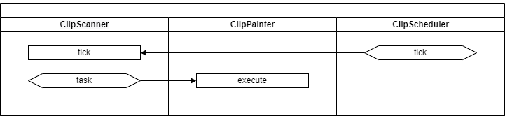

# Design pattern - Command pattern


::: tip 예제 코드
[https://github.com/ryujt/design_pattern](https://github.com/ryujt/design_pattern)
:::


## 강의 개요

이번 강의에서는 State 패턴이 무엇이고 언제 사용하는 지에 대해서 알아봅니다.

우선 위키백과의 정의를 살펴보면 다음과 같습니다.

::: tip 커맨드 패턴(command pattern)
커맨드 패턴(Command pattern)이란 요청을 객체의 형태로 캡슐화하여 사용자가 보낸 요청을 나중에 이용할 수 있도록 매서드 이름, 매개변수 등 요청에 필요한 정보를 저장 또는 로깅, 취소할 수 있게 하는 패턴이다.

커맨드 패턴에는 명령(command), 수신자(receiver), 발동자(invoker), 클라이언트(client)의 네개의 용어가 항상 따른다. 커맨드 객체는 수신자 객체를 가지고 있으며, 수신자의 메서드를 호출하고, 이에 수신자는 자신에게 정의된 메서드를 수행한다. 커맨드 객체는 별도로 발동자 객체에 전달되어 명령을 발동하게 한다. 발동자 객체는 필요에 따라 명령 발동에 대한 기록을 남길 수 있다. 한 발동자 객체에 다수의 커맨드 객체가 전달될 수 있다. 클라이언트 객체는 발동자 객체와 하나 이상의 커맨드 객체를 보유한다. 클라이언트 객체는 어느 시점에서 어떤 명령을 수행할지를 결정한다. 명령을 수행하려면, 클라이언트 객체는 발동자 객체로 커맨드 객체를 전달한다.

* 위키백과
:::


## 미션




## 패턴 적용 전의 코드

``` java
import java.util.Scanner;

class Shape {
    final static int SHAPE_TRIANGLE = 0;
    final static int SHAPE_RECTANGLE = 1;
    final static int SHAPE_CIRCLE = 2;

    int type;
    int x;
    int y;

    Shape(int type, int x, int y) {
        this.type = type;
        this.x = x;
        this.y = y;
    }
}

class Painter {
    public void execute(Shape shape)
    {
        switch (shape.type) {
            case Shape.SHAPE_TRIANGLE:
                System.out.println(String.format("삼각형 그리기 - x: %d, y: %d", shape.x, shape.y));
                break;
            case Shape.SHAPE_RECTANGLE:
                System.out.println(String.format("사각형 그리기 - x: %d, y: %d", shape.x, shape.y));
                break;
            case Shape.SHAPE_CIRCLE:
                System.out.println(String.format("원 그리기 - x: %d, y: %d", shape.x, shape.y));
                break;
        }
    }
}

public class Main {
    public static void main(String[] args) {
        Painter painter = new Painter();
        Scanner in = new Scanner(System.in);
        while (true) {
            String line = in.nextLine();
            switch (line) {
                case "t": painter.execute(new Shape(Shape.SHAPE_TRIANGLE, 0, 0)); break;
                case "r": painter.execute(new Shape(Shape.SHAPE_RECTANGLE, 10, 10)); break;
                case "c": painter.execute(new Shape(Shape.SHAPE_CIRCLE, 100, 100)); break;
                case "q": return;
            }
        }
    }
}
```

## Command 패턴 적용 후

``` java
import java.util.Scanner;

class Shape {
    final static int SHAPE_TRIANGLE = 0;
    final static int SHAPE_RECTANGLE = 1;
    final static int SHAPE_CIRCLE = 2;

    int type;
    int x;
    int y;

    Shape(int type, int x, int y) {
        this.type = type;
        this.x = x;
        this.y = y;
    }
}

class DrawCommand {
    int x;
    int y;

    DrawCommand(int x, int y) {
        this.x = x;
        this.y = y;
    }

    public void execute() {}
}

class DrawTriangle extends DrawCommand {
    DrawTriangle(int x, int y) {
        super(x, y);
    }

    public void execute() {
        System.out.println(String.format("삼각형 그리기 - x: %d, y: %d", x, y));
    }
}

class DrawRectangle extends DrawCommand {
    DrawRectangle(int x, int y) {
        super(x, y);
    }

    public void execute() {
        System.out.println(String.format("사각형 그리기 - x: %d, y: %d", x, y));
    }
}

class DrawCircle extends DrawCommand {
    DrawCircle(int x, int y) {
        super(x, y);
    }

    public void execute() {
        System.out.println(String.format("원 그리기 - x: %d, y: %d", x, y));
    }
}

class Painter {
    public void execute(DrawCommand command)
    {
        command.execute();
    }
}

public class Main {
    public static void main(String[] args) {
        Painter painter = new Painter();
        Scanner in = new Scanner(System.in);
        while (true) {
            String line = in.nextLine();
            switch (line) {
                case "t": painter.execute(new DrawTriangle(0, 0)); break;
                case "r": painter.execute(new DrawRectangle(10, 10)); break;
                case "c": painter.execute(new DrawCircle(100, 100)); break;
                case "q": return;
            }
        }
    }
}
```


## undo 기능 추가

``` java
...
class DrawCommand {
    ...
    public void execute() {}
    public void undo() { }
}
...
class Painter {
    public void execute(DrawCommand command)
    {
        command.execute();
        lastCommand = command;
    }

    public void undo() {
        if (lastCommand != null) lastCommand.undo();
    }

    private DrawCommand lastCommand = null;
}

public class Main {
    public static void main(String[] args) {
        Painter painter = new Painter();
        Scanner in = new Scanner(System.in);
        while (true) {
            String line = in.nextLine();
            switch (line) {
                case "t": painter.execute(new DrawTriangle(0, 0)); break;
                case "r": painter.execute(new DrawRectangle(10, 10)); break;
                case "c": painter.execute(new DrawCircle(100, 100)); break;
                case "b":  painter.undo(); break;
                case "q": return;
            }
        }
    }
}
```